# QA Guardian User Guide

Welcome to QA Guardian - your enterprise QA automation platform.

## Table of Contents

1. [UI Overview](#ui-overview)
2. [Authentication](#authentication)
3. [Getting Started](#getting-started)
4. [Creating Your First Test](#creating-your-first-test)
5. [Visual Regression Testing](#visual-regression-testing)
6. [Performance Testing](#performance-testing)
7. [Load Testing](#load-testing)
8. [Accessibility Testing](#accessibility-testing)
9. [MCP Integration (AI Agents)](#mcp-integration)
10. [Settings & Configuration](#settings--configuration)
11. [Error Handling](#error-handling)
12. [Empty States](#empty-states)
13. [Responsive Design](#responsive-design)
14. [Theme Variants](#theme-variants)

---

## UI Overview

### Dashboard

The dashboard provides an at-a-glance view of your testing activity:

Key dashboard elements:

1. **Sidebar** - Main navigation menu for accessing all features
2. **Projects** - Total number of projects in your organization
3. **Test Suites** - Number of test suites across all projects
4. **Total Tests** - Combined count of all test cases
5. **Test Runs** - Number of test executions
6. **Pass Rate** - Percentage of successful test runs (green = good)
7. **Passed** - Count of successful test runs
8. **Failed** - Count of failed test runs (red = attention needed)
9. **Notifications** - Badge showing unread alert count

### Analytics & Pass Rate Trends

The Analytics page shows detailed test metrics and trends:

- **Pass Rate Trends**: Line chart showing daily pass rate over time
- **Overall Pass Rate**: Aggregated success percentage
- **Total Runs/Passed/Failed**: Summary statistics

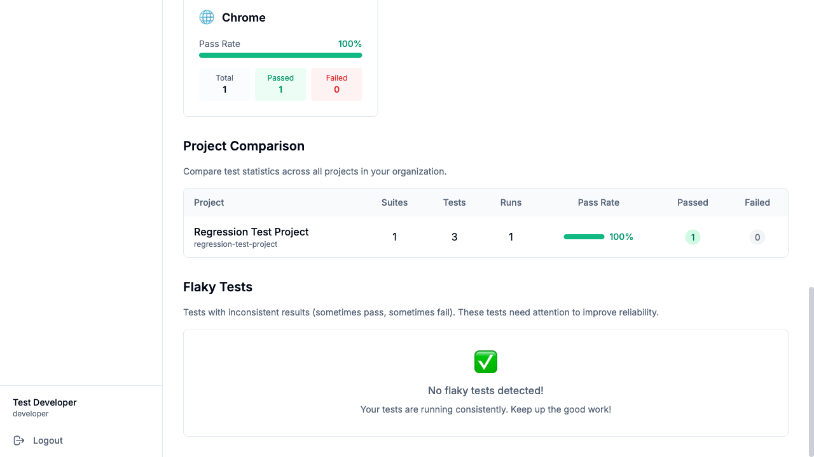

- **Browser-Specific Pass Rates**: Results by browser (Chrome, Firefox, Safari)
- **Project Comparison**: Compare metrics across projects
- **Flaky Tests**: Identify tests with inconsistent results

### Projects List

Manage all your test projects from the Projects page:

- Create new projects with the "Create Project" button
- Filter and search existing projects
- Archive/restore projects as needed

### Test Suite View

Each test suite displays its tests in an organized table:

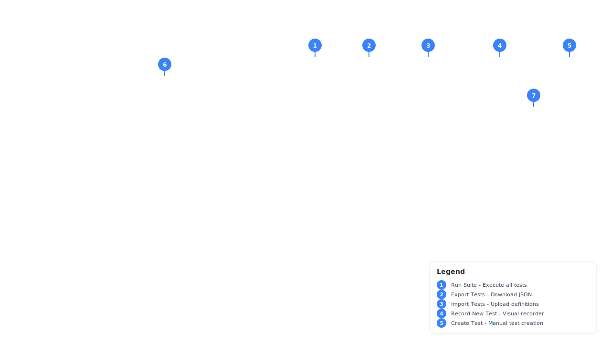

The test suite toolbar provides quick access to key actions:

1. **Run Suite** - Execute all tests in the suite at once
2. **Export Tests** - Download test definitions as JSON for backup
3. **Import Tests** - Upload test definitions from JSON file
4. **Record New Test** - Launch the visual test recorder (Playwright)
5. **Create Test** - Manually define a new test with custom configuration
6. **Browser/Viewport** - Shows the configured browser and viewport size
7. **Search** - Filter tests by name or description

### Test Details

Individual test pages show configuration and execution options:

- View and edit test steps
- Configure test settings
- Access K6 scripts for load tests
- Run, schedule, or duplicate tests

---

## Authentication

QA Guardian provides secure authentication with multiple sign-in options.

### Login Page

Access your account through the login page:

- **Email/Password**: Standard authentication with email and password
- **Google OAuth**: One-click sign-in with your Google account
- **Forgot Password**: Link to reset your password if forgotten
- **Test Accounts**: Development environment includes test accounts for different roles

### Registration

Create a new account to get started:

- **Name**: Your display name within the platform
- **Email**: Your email address (must be unique)
- **Password**: Minimum 8 characters required
- **Confirm Password**: Re-enter to verify your password

### Password Reset

Forgot your password? Request a reset link:

1. Click "Forgot your password?" on the login page
2. Enter your email address
3. Click "Send Reset Link"
4. Check your email for the reset link
5. Follow the link to set a new password

### Google OAuth

For convenience, you can sign in with Google:

- Click "Sign in with Google" on the login page
- Authorize QA Guardian to access your Google account
- You'll be automatically logged in and redirected to the dashboard

---

## Getting Started

### Creating an Account

1. Visit the QA Guardian login page
2. Click "Sign Up" or use Google OAuth
3. Verify your email address
4. Create or join an organization

### Setting Up Your First Project

1. Click "New Project" from the dashboard
2. Enter your project name and description
3. Connect your GitHub repository (optional)
4. Configure environment variables

---

## Creating Your First Test

### Create Test Dialog

When creating a new test, choose from four test types:

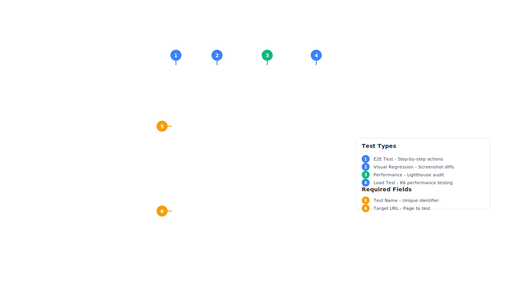

Test type options:

1. **E2E Test** - Step-by-step actions with assertions (Playwright-based)
2. **Visual Regression** - Screenshot comparison for UI changes
3. **Performance** - Lighthouse audit for Core Web Vitals (currently selected in green)
4. **Load Test** - K6-based load and stress testing

Required fields:

5. **Test Name** - Unique identifier for your test (required, marked with *)
6. **Target URL** - The page URL to test (required, marked with *)

### Test List View

View all tests in a suite from the test list:

### Editing Tests

Use the test editor to modify test details:

### Using the Visual Recorder

1. Navigate to your project
2. Click "New Test Suite" → "New Test"
3. Enter the URL you want to test
4. Click "Start Recording"
5. Perform actions in the browser - clicks, typing, etc.
6. Add assertions to verify behavior
7. Click "Save Test"

### Running Tests

Execute tests and view results in real-time:

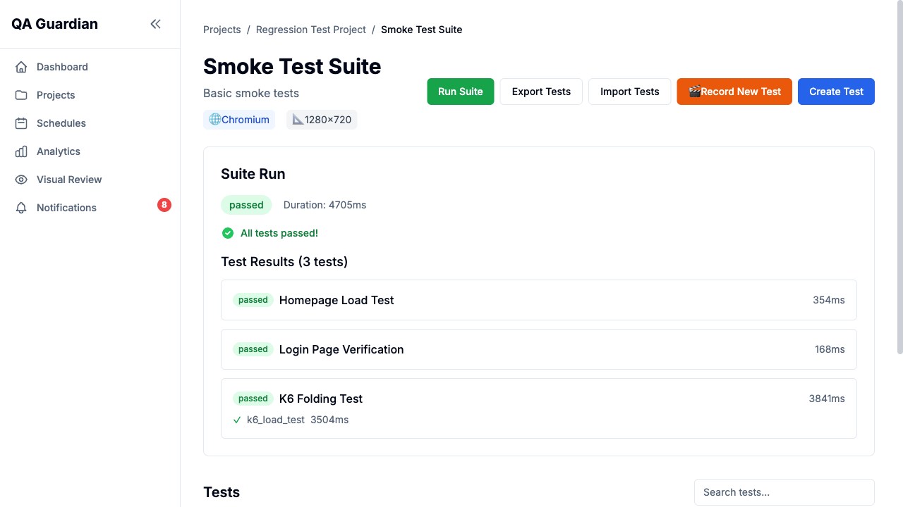

- **Single Test:** Click the play button on any test
- **Full Suite:** Click "Run All" on a test suite
- **Scheduled:** Set up a cron schedule for automated runs

---

## Visual Regression Testing

Catch unintended visual changes automatically.

### Baseline Creation

The first run of a visual regression test captures a baseline screenshot:

- Navigate to a Visual Regression test
- Click "Run Test to Create Baseline"
- The captured screenshot becomes the reference for future comparisons

### Visual Comparison Results

Subsequent runs compare against the baseline and show the result:

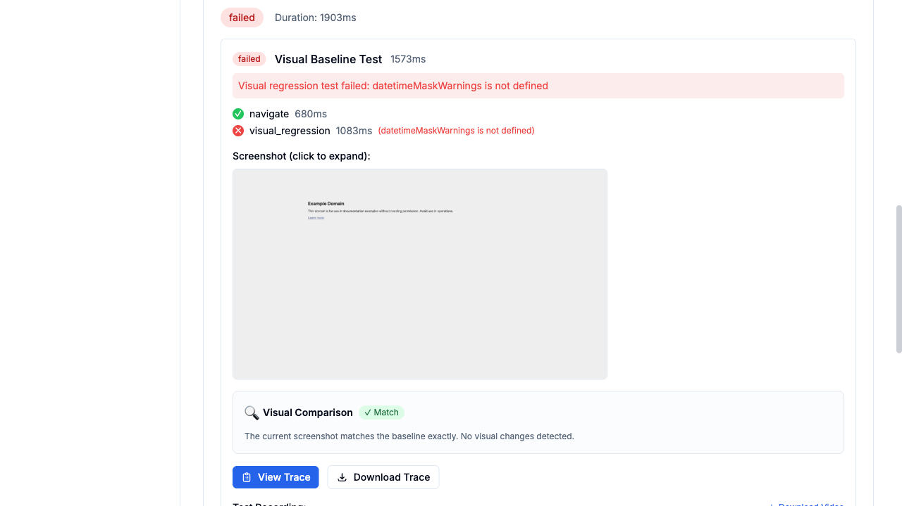

- **✓ Match**: Current screenshot matches the baseline exactly
- **⚠ Diff Detected**: Visual differences found (requires review)
- View screenshot thumbnails that expand on click

### Visual Review Queue

Review and approve pending visual changes from the Visual Review page:

- Filter changes by project, suite, or diff severity
- Batch approve or reject multiple changes
- Side-by-side, slider, and overlay comparison modes

### How It Works

1. First run captures **baseline screenshots**
2. Subsequent runs compare against baselines
3. Differences are highlighted for review
4. Approve or reject changes

### Key Features

- Side-by-side comparison view
- Overlay slider for pixel diff
- Dynamic content masking
- Responsive breakpoint testing
- Batch approval for multiple screenshots

---

## Performance Testing

Monitor Core Web Vitals with Lighthouse integration.

### Creating a Performance Test

Create a Lighthouse performance test to measure page speed and Core Web Vitals:

- Select "Lighthouse Performance" as the test type
- Enter the URL to audit
- Configure performance budget thresholds

### Performance Budget Configuration

Set thresholds for key metrics to track performance regressions:

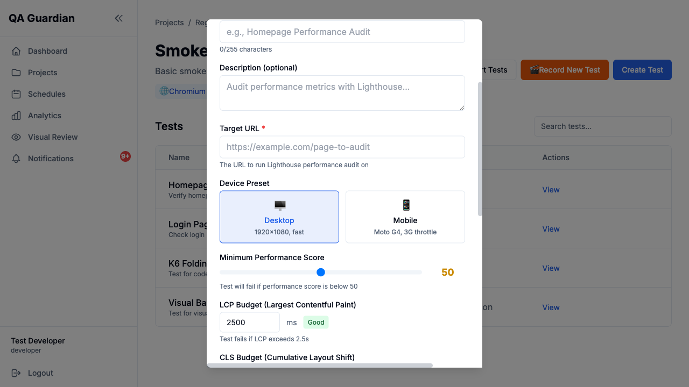

- **LCP Budget**: Maximum acceptable Largest Contentful Paint (e.g., 2500ms)
- **CLS Budget**: Maximum acceptable Cumulative Layout Shift (e.g., 0.1)
- Thresholds determine pass/fail status for automated testing

### Lighthouse Scores & Results

After running a performance test, view comprehensive Lighthouse scores:

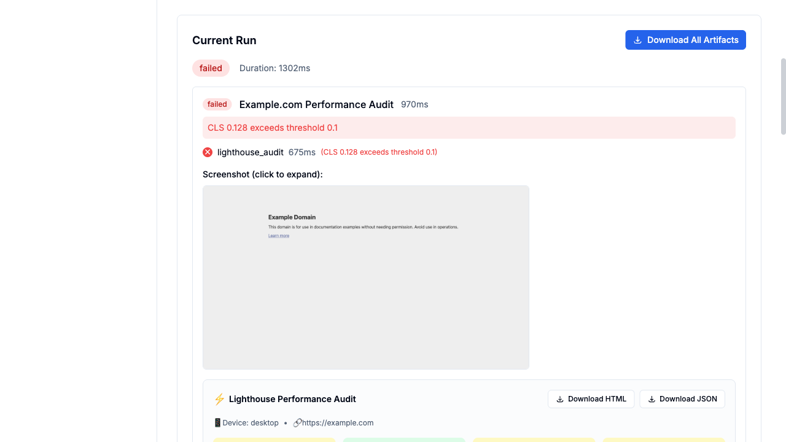

- **Performance Score**: Overall performance rating (0-100)
- **Accessibility Score**: WCAG compliance rating
- **Best Practices Score**: Web standards adherence
- **SEO Score**: Search engine optimization rating

### Core Web Vitals Dashboard

View detailed Core Web Vitals metrics for each test run:

| Metric | Description |
|--------|-------------|
| **LCP** | Largest Contentful Paint - loading performance |
| **FCP** | First Contentful Paint - initial render time |
| **CLS** | Cumulative Layout Shift - visual stability |
| **TTI** | Time to Interactive - when page becomes usable |
| **TBT** | Total Blocking Time - main thread blocking |
| **INP** | Interaction to Next Paint - responsiveness |
| **TTFB** | Time to First Byte - server response time |

### Performance Trends

Track performance over time with the trends chart:

- View score trends across multiple test runs
- Identify performance regressions early
- Compare metrics over 7-day, 30-day, or custom periods

---

## Load Testing

Simulate traffic with K6 integration.

### Test Types

- **Load Test:** Normal expected traffic
- **Stress Test:** Beyond normal capacity
- **Spike Test:** Sudden traffic surge
- **Soak Test:** Extended duration

### Creating a Load Test

Configure your K6 load test with Virtual Users, duration, and ramp-up settings:

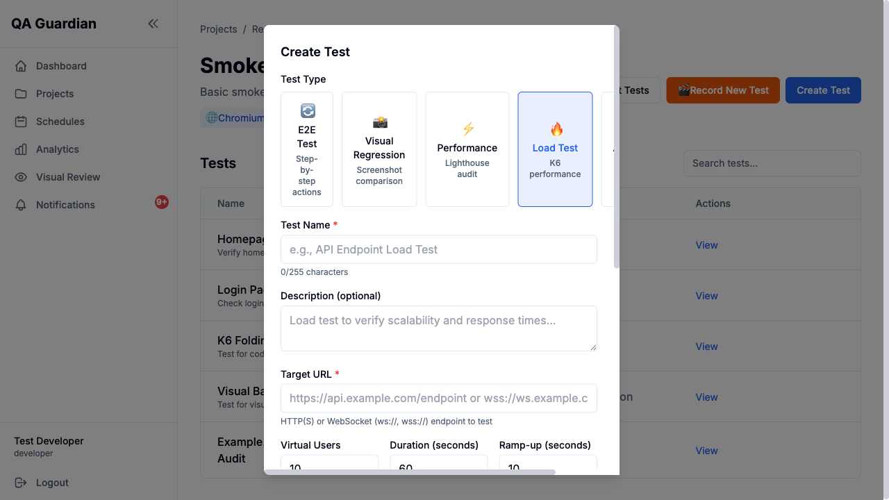

- **Virtual Users (VUs)**: Number of concurrent simulated users
- **Duration**: How long the test runs
- **Ramp-up**: Time to gradually increase to max VUs
- **Target URL**: HTTP(S) or WebSocket endpoint to test

### K6 Script Editor

Write custom K6 scripts with syntax highlighting and code folding:

- Edit the auto-generated K6 script for advanced scenarios
- Configure thresholds for pass/fail criteria (e.g., `p(95)<500ms`)
- Define custom metrics and checks
- Copy or download the script to run locally with K6 CLI

### Load Test Results

View comprehensive load test metrics after execution:

| Metric | Description |
|--------|-------------|
| **Total Requests** | Number of HTTP requests made |
| **Avg Req/sec** | Average throughput |
| **Peak RPS** | Maximum requests per second achieved |
| **Virtual Users** | Concurrent users simulated |
| **Data Transferred** | Total data sent/received |

### Response Time Percentiles

- **Min/Max**: Fastest and slowest response times
- **p50 (median)**: Half of requests faster than this
- **p90/p95/p99**: Tail latency percentiles
- **HTTP Status Codes**: Breakdown by response code

---

## Accessibility Testing

Ensure WCAG compliance with axe-core scanning.

### Creating an Accessibility Test

Configure your accessibility audit with WCAG compliance level selection:

- **Test Type**: Select "Accessibility Test (axe-core)" for WCAG auditing
- **WCAG Level**: Choose compliance level (A, AA, or AAA)
- **URL**: Enter the page to audit

### Compliance Levels

- **WCAG 2.1 A:** Minimum compliance (essential accessibility)
- **WCAG 2.1 AA:** Standard compliance (recommended for most sites)
- **WCAG 2.1 AAA:** Enhanced compliance (highest level)

### Accessibility Score Dashboard

View the overall accessibility score and summary after running a test:

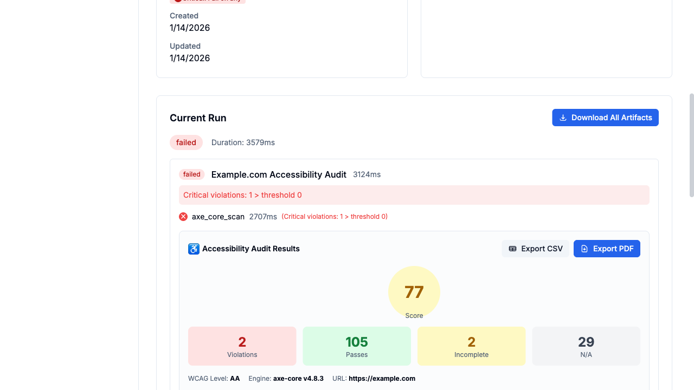

- **Accessibility Score**: Overall rating (0-100)
- **Violations**: Number of accessibility issues found
- **Passes**: Number of checks that passed
- **Status**: Pass/Fail based on threshold configuration

### Viewing Issues

After running an accessibility scan, review violations by impact level:

1. Run an accessibility scan
2. View issues by severity (Critical → Minor)
3. Filter by impact: Critical, Serious, Moderate, Minor
4. See affected elements count for each violation

### Issue Details & Remediation

Expand any violation to see detailed remediation guidance:

- **Description**: What the violation means
- **Impact**: Severity level (Critical, Serious, etc.)
- **Help URL**: Link to axe-core documentation
- **Affected Elements**: CSS selectors for elements with issues
- **How to Fix**: Step-by-step remediation guidance

---

## MCP Integration

Let AI agents like Claude Code interact with QA Guardian through the Model Context Protocol.

### Available Tools

| Tool | Description |
|------|-------------|
| `trigger-test-run` | Start a test suite |
| `get-run-status` | Check test progress |
| `get-test-results` | Get detailed results |
| `cancel-test-run` | Stop a running test |

### Creating an MCP API Key

Create an API key with MCP-specific scopes for AI agent integration:

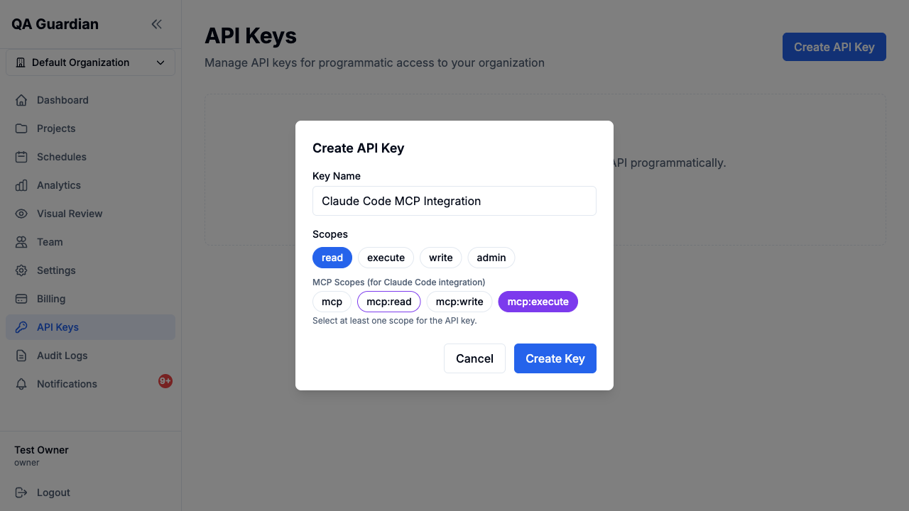

- **Key Name**: Descriptive name (e.g., "Claude Code MCP Integration")
- **MCP Scopes**: Select `mcp`, `mcp:read`, `mcp:write`, or `mcp:execute`
- The key is shown only once - save it securely

### Monitoring MCP Connections

View active MCP connections from AI agents in Organization Settings:

- See the number of active connections
- Monitor which AI agents are connected
- Troubleshoot connection issues

### Setting Up MCP Access

1. Go to Settings → API Keys
2. Create a new API key with MCP scopes
3. Configure your AI agent with the key
4. Connect via stdio or SSE transport

---

## Settings & Configuration

QA Guardian provides comprehensive settings management at multiple levels.

### Organization Settings

Configure organization-wide settings from the Settings page:

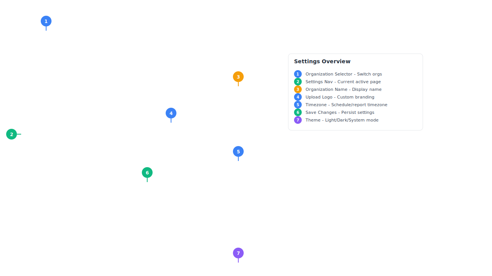

Settings page elements:

1. **Organization Selector** - Switch between organizations (if you belong to multiple)
2. **Settings Navigation** - Currently active settings section (highlighted)
3. **Organization Name** - Editable display name for your organization
4. **Upload Logo** - Add custom branding with your organization logo (PNG, JPG, GIF up to 2MB)
5. **Timezone** - Set default timezone for schedules and reports
6. **Save Changes** - Persist your configuration changes
7. **Theme Preference** - Choose Light, Dark, or System (auto) mode

Additional settings available:
- **Notification Preferences**: Email alerts, failure notifications, weekly digest
- **Test Defaults**: Default timeout, browser, and retry settings
- **Session Management**: View and manage active sessions
- **Artifact Retention**: Configure cleanup policies
- **Integrations**: Slack, MCP connections

### Project Settings

Each project has its own configuration accessible via the Settings tab:

- **Project Details**: ID, slug, creation date, base URL
- **Project Access**: Manage team member access and roles
- **Alert Channels**: Configure email, Slack, or webhook notifications
- **Environment Variables**: Store secrets and configuration values

### API Keys Management

Generate API keys for programmatic access and CI/CD integration:

- **Key Name**: Descriptive name for the key
- **Scopes**: Permission levels (read, execute, write, admin)
- **MCP Scopes**: Special scopes for Claude Code integration
- **Security**: Keys are shown only once upon creation

### API Documentation (Swagger UI)

QA Guardian provides interactive API documentation via Swagger UI at `/api/docs`:

**API Overview**

The Swagger UI shows:
- All available API endpoints grouped by category
- HTTP methods (GET, POST, PATCH, DELETE, PUT)
- Version information (OAS 3.0)
- Authorization options

**Testing API Endpoints**

Use "Try it out" to test endpoints directly:
- Enter path parameters (like project ID)
- Click Execute to send the request
- View the curl command for copying

**API Responses**
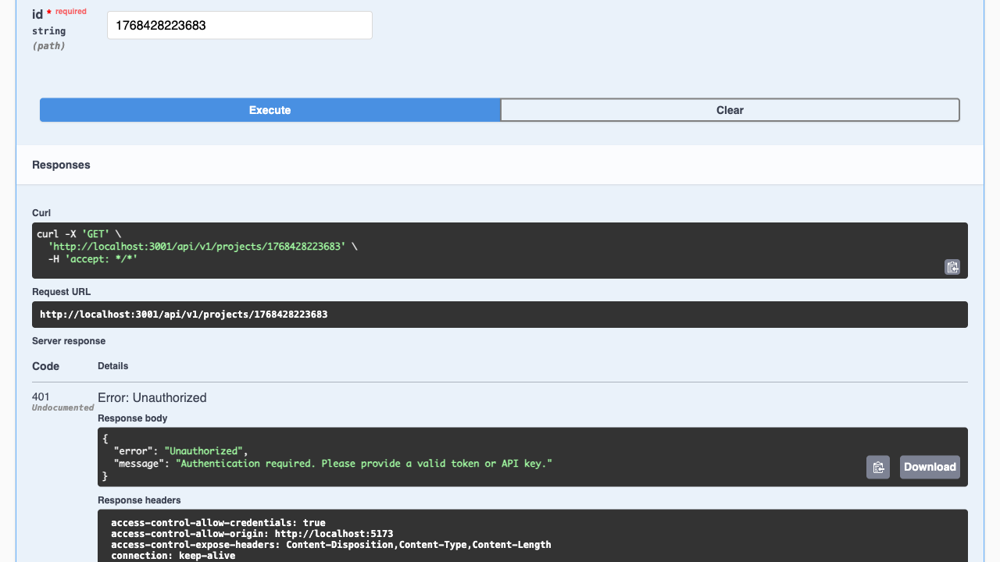

Response details include:
- **Curl**: Copy-paste curl command with syntax highlighting
- **Request URL**: The full URL with parameters
- **Response body**: JSON response with proper formatting
- **Response headers**: All HTTP headers returned

---

## Error Handling

QA Guardian displays clear error messages to help you troubleshoot issues quickly.

### Authentication Errors

When login credentials are incorrect, a clear error message is displayed:

- **Invalid email or password**: The credentials don't match any account
- The form remains filled so you can correct and retry

### Validation Errors

Form validation errors are shown inline to help you fix input issues:

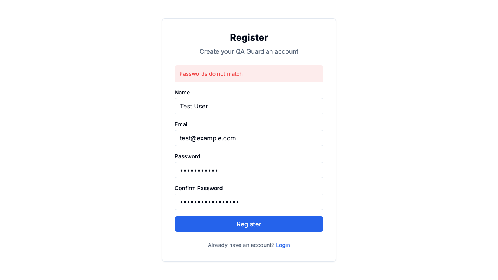

- **Passwords do not match**: Password confirmation doesn't match the original
- Error messages appear at the top of the form in red
- All fields remain filled so you can correct the specific issue

### Page Not Found (404)

When navigating to a non-existent page, a friendly 404 page is displayed:

- Clear "404" indicator with "Page not found" message
- "Go Home" button to return to the main page

### Network & API Errors

When tests encounter network issues, detailed error information is displayed:

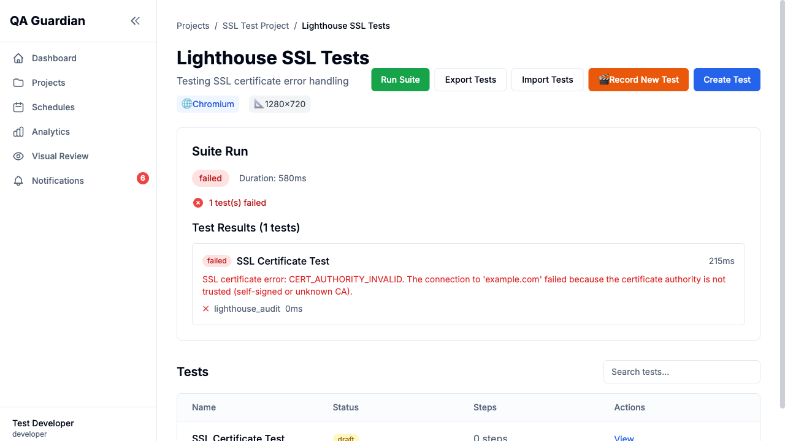

- **SSL Certificate errors**: Shows certificate validation failures
- **Connection failures**: Displays the specific connection error
- Error details help diagnose the root cause

### API Timeout Errors

When API requests or tests take too long, timeout errors are shown:

- **Lighthouse audit timed out**: Performance tests that exceed the timeout limit
- Duration is displayed to help tune timeout settings
- Specific error messages explain what failed and why

---

## Empty States

QA Guardian provides helpful empty states with clear call-to-action buttons.

### Empty Projects

When you don't have any projects yet:

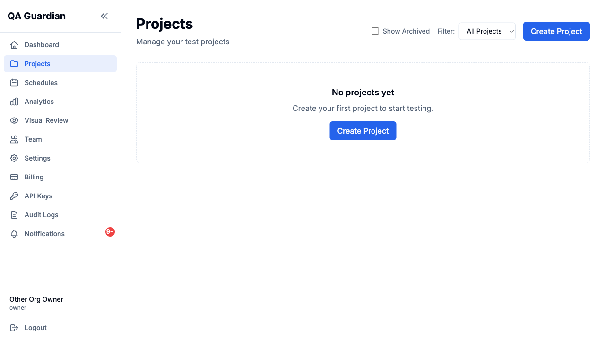

- Clear "No projects yet" message
- "Create Project" button to get started

### Empty Schedules

When no test schedules are configured:

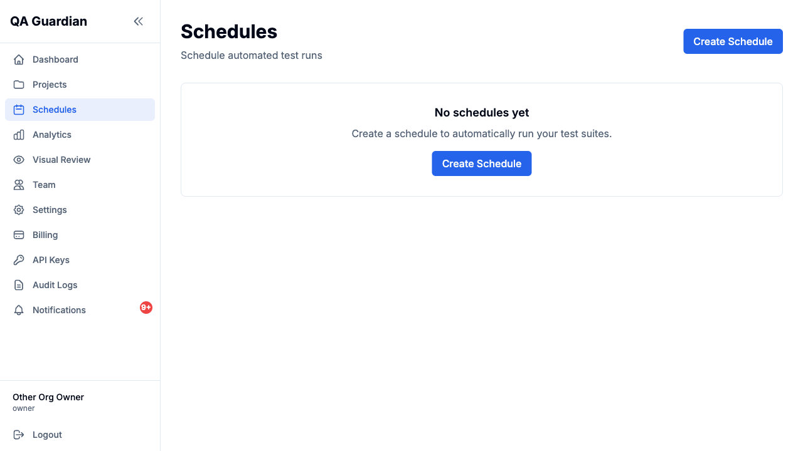

- "No schedules yet" message with guidance
- "Create Schedule" button to set up automated runs

### Empty Search Results

When search doesn't find matching tests:

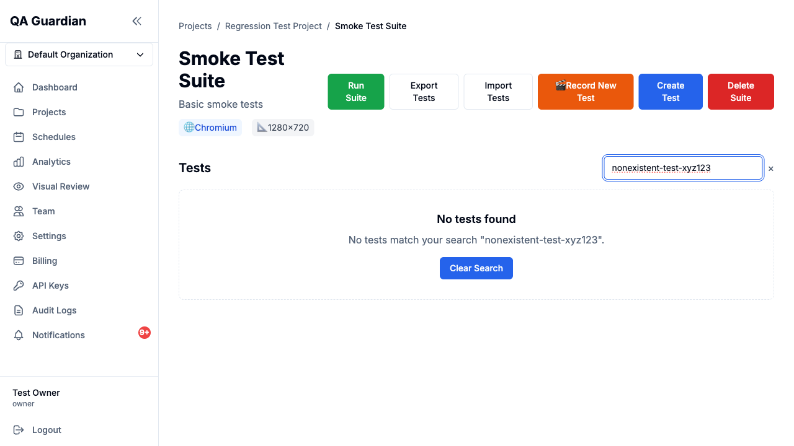

- Shows the search term that found no matches
- "Clear Search" button to reset the filter

### All Caught Up (Visual Review)

When there are no pending visual changes to review:

- Friendly "All caught up!" message with checkmark
- Indicates visual review queue is empty

---

## Responsive Design

QA Guardian is fully responsive and works on all device sizes.

### Mobile View (375px)

On mobile devices, the sidebar collapses into a hamburger menu:

- Hamburger menu icon in the header
- Cards stack vertically for easier reading
- Touch-friendly interface

### Mobile Navigation

Tap the menu icon to access navigation:

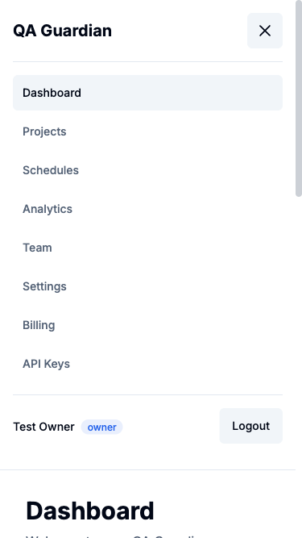

- Full navigation menu slides down
- User info and logout at the bottom
- Tap outside to close

### Tablet View (768px)

On tablets, the sidebar remains visible but narrower:

- Sidebar with icons and labels
- Cards adapt to available width
- Full navigation always accessible

### Desktop View (1280px+)

On desktop, the full layout with expanded sidebar:

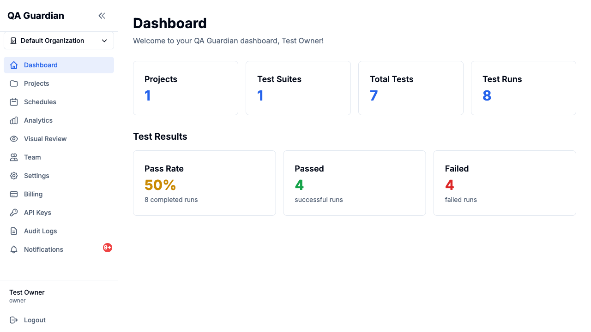

- Full sidebar with icons and text labels
- 4-column card layout
- Organization switcher visible

### Responsive Breakpoints

| Breakpoint | Width | Layout |
|------------|-------|--------|
| Mobile | < 640px | Hamburger menu, stacked cards |
| Tablet | 640-1024px | Sidebar visible, 2-3 column cards |
| Desktop | > 1024px | Full sidebar, 4 column cards |

---

## Theme Variants

QA Guardian supports light and dark themes to match your preference or system settings.

### Theme Selection

Change your theme from Settings → User Preferences → Theme:

| Option | Description |
|--------|-------------|
| **System** | Automatically follows your device's light/dark mode setting |
| **Light** | Always use light theme (better for bright environments) |
| **Dark** | Always use dark theme (easier on eyes in low light) |

### Light Mode

The light theme features a clean, bright interface:

**Dashboard (Light)**

**Settings (Light)**

### Dark Mode

The dark theme reduces eye strain and saves battery on OLED screens:

**Dashboard (Dark)**

**Settings (Dark)**

### Additional Theme Screenshots

All major pages support both themes:

| Page | Light | Dark |
|------|-------|------|
| Dashboard | [dashboard-light.png](../images/screenshots/themes/dashboard-light.png) | [dashboard-dark.png](../images/screenshots/themes/dashboard-dark.png) |
| Projects | [projects-light.png](../images/screenshots/themes/projects-light.png) | [projects-dark.png](../images/screenshots/themes/projects-dark.png) |
| Analytics | [analytics-light.png](../images/screenshots/themes/analytics-light.png) | [analytics-dark.png](../images/screenshots/themes/analytics-dark.png) |
| Settings | [settings-light.png](../images/screenshots/themes/settings-light.png) | [settings-dark.png](../images/screenshots/themes/settings-dark.png) |

---

## Need Help?

- 📖 [Full Feature Documentation](../generated/)
- 📊 [Feature Statistics](../STATS.md)
- 🐛 Report issues on GitHub
